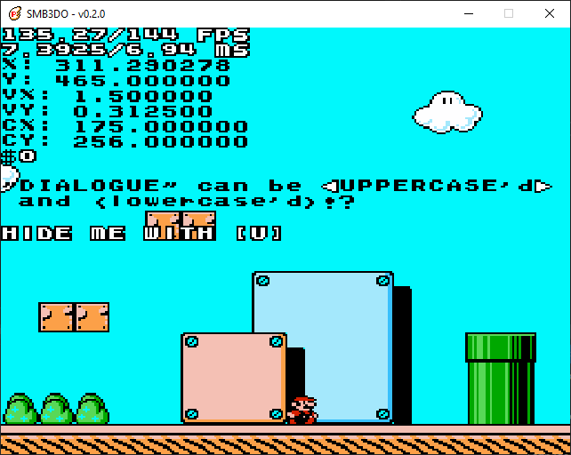
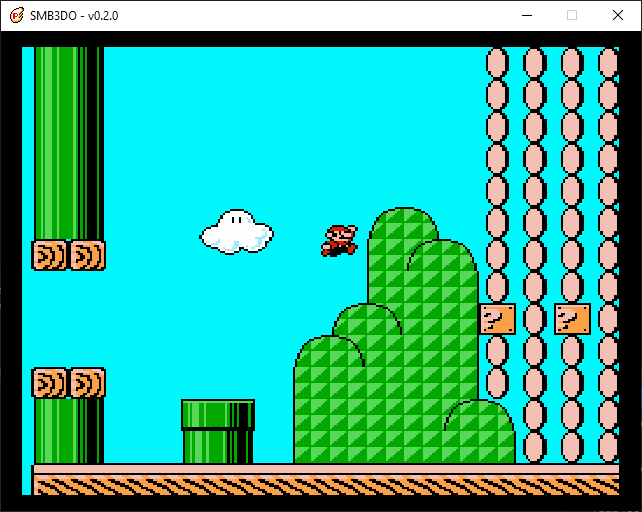
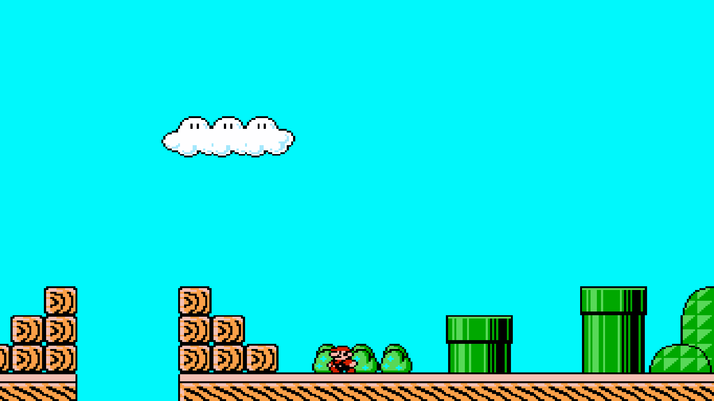
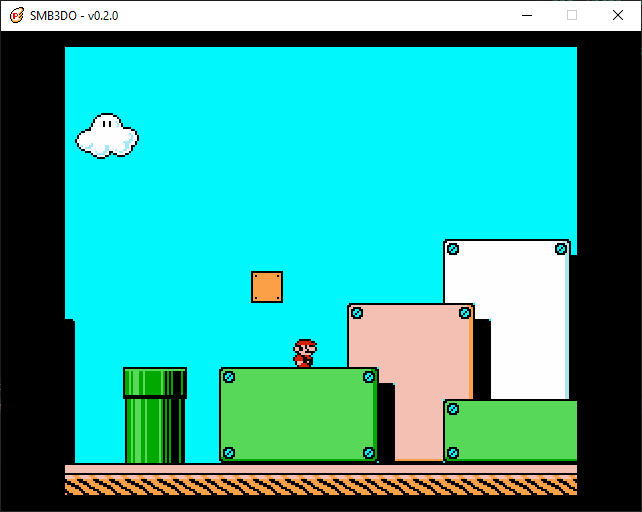

# Super Mario Bros.  3-Do (SMB3DO)

 

### A Super Mario Bros. 3 Fangame

A personal project that aims to _three_-do the classic Nintendo NES game Super Mario Bros. 3.  This project arose out of my dissatisfaction of Super Mario Maker and Super Mario Maker 2's shortcomings and limitations, particularly in the SMB3 style.  While ROM hacking is always an option, SMB3's compression makes it somewhat tricky to mod (last time I checked).  Plus, creating my own rendition would allow me to add new features and tweak anything to my liking.  So, here we are.

This project is written in C++14 and runs on the SDL2 framework.

##  Screenshots 

 

 

##  Features and Changelog 

### Current Release (v0.2.0)

* Basic camera
* Basic level format
* Animated Mario
* Improved variable refresh rate support
* Hitbox visualization toggle
* On-screen debug info
* Collectable coins
* Semisolid platforms

#### v0.1.0

* Keyboard input (see "How to Use")
* Hardware accelerated rendering
* Support for multiple resolutions
* Fullscreen/windowed modes
* SD/Widescreen video modes
* Basic variable refresh rate support
* Simple sprite/image blitting
* Tileset and tilemap rendering
* Tile-based collision
* Basic SMB3-accurate player physics (walking, running, and jumping)

### Long-Term Plans

* Implement all features of the original SMB3
* Create my own SMB3 'sequel'
* User-friendly level/map/game editor
* Support for NES, All-Stars, and custom assets
* "Retro" and "Modern" video options
* Controller support
* Linux support
* Variable refresh rate (e.g. 120 Hz) support

[Detailed development roadmap](https://docs.google.com/spreadsheets/d/1Y0XjZVZ6z5f_Yi8HuqKNcNB47MKjdfytgAIx97y7Uow/edit?usp=sharing)

##  How to Use 

Download the `.zip` file for the latest relase in the Releases tab.  Unzip to a location of your choice and then simply run `smb3do.exe`!  If you want to try out the latest features (and bugs), you can optionally build your own executable directly from the source code (see "Building From Source" below).

### Controls

* : Move / : Run / : Jump
*  - Toggle hitbox visual
*  - Toggle debug info
*  - Toggle integer/best-fit scaling (disables widescreen mode)
*  - Toggle widescreen/standard mode (disables integer scaling)
*  - Toggle between 8:7 and 4:3 aspect ratios (i.e. between perfectly square and CRT-like pixels)
*  - Toggle fullscreen/windowed mode

##  Building From Source 

Visual Studio solution and project files have been removed for now as part of streamlining the build process.  The project instead includes a Makefile and now compiles using `g++` on MinGW32/MinGW64 (Windows) or Linux.

### Windows

1. Install [MSYS2](https://www.msys2.org/)
2. Install `SDL2`, `SDL2_image`, `SDL2_mixer`, and `SDL2_ttf`
    * MinGW32: `pacman -S mingw-w64-i686-SDL2 mingw-w64-i686-SDL2_image mingw-w64-i686-SDL2_mixer mingw-w64-i686-SDL2_ttf`
    * MinGW64: `pacman -S mingw-w64-x86_64-SDL2 mingw-w64-x86_64-SDL2_image mingw-w64-x86_64-SDL2_mixer mingw-w64-x86_64-SDL2_ttf`
3. Clone repo
4. Run `make release` from project root
5. Run `./bin/{win32|win64}/smb3do.exe`

### Linux (Debian)

1. Install `SDL2`, `SDL2_image`, `SDL2_mixer`, and `SDL2_ttf`
    * `sudo apt-get install libsdl2-dev libsdl2-image-dev libsdl2-mixer-dev libsdl2-ttf-dev`
2. Clone repo
3. Run `make release` from project root
4. Run `./bin/linux/smb3do`

##  Dependencies 

* [Simple Directmedia Layer 2.0](https://www.libsdl.org/) (v2.28.1)
* [TinyXML2](https://github.com/leethomason/tinyxml2) (v8.1.0)

##  Credits 

* SmokedSeaBass - Core Programmer and Designer

### Special Thanks

* Jdaster64 - SMB3 player physics breakdown
* Southbird - SMB3 disassembly
* Christopher Hebert - ["Reconstructing Cave Story" YouTube series](https://www.youtube.com/watch?v=IufkC1IRY2Q&list=PL006xsVEsbKjSKBmLu1clo85yLrwjY67X)
* Lazy Foo' Productions - [Beginning Game Programming v2.0](https://lazyfoo.net/tutorials/SDL/index.php) (SDL2 Tutorials)
* Nintendo - Developer/Publisher of Super Mario Bros. 3
