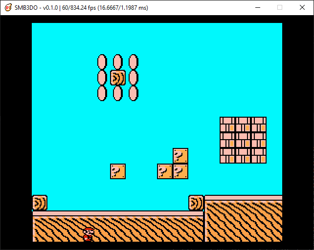

# Super Mario Bros. 3-Do (SMB3DO)
### A Super Mario Bros. 3 Fangame
A personal project that aims to re-imagine the classic Nintendo NES game Super Mario Bros. 3.  This project arose out of my dissatisfaction of Super Mario Maker and Super Mario Maker 2's shortcomings and limitations, particularly in the SMB3 style.  While ROM hacking is always an option, SMB3's compression makes it a particarly tricky task to mod without destroying the ROM (last time I checked).  Plus, creating my own rendition would allow me to add new features and tweak anything to my liking.  And so here we are, SMB3 remade for the modern era.

This project is written in C++14 and runs on the SDL2 framework.  Currently there is no executable build, but see below for building from source.

## Features
### Upcoming (v0.1.0)
* [x] Hello world!
* [x] Basic keyboard input
* [x] Hardware accelerated rendering
* [x] Support for multiple resolutions
* [x] Fullscreen/windowed modes
* [x] SD/Widescreen video modes
* [x] Basic variable refresh rate support
* [x] Simple sprite/image blitting
* [x] Tileset rendering
* [ ] Tile-based collision
* [x] Basic SMB3-accurate player physics (running and jumping)
* [ ] Basic camera

### Long-term Planned Features:
* Implement all features of the original SMB3
* Create my own SMB3 'sequel'
* User-friendly level/map/game editor
* Support for NES, All-Stars, and custom assets
* "Retro" and "Modern" video options
* Controller/keyboard support
* Linux and Windows support
* Variable refresh rate (e.g. 120 Hz) support

[Detailed development roadmap](https://docs.google.com/spreadsheets/d/1Y0XjZVZ6z5f_Yi8HuqKNcNB47MKjdfytgAIx97y7Uow/edit?usp=sharing)

## Dependencies and Utilities
* [Simple Directmedia Layer 2.0](https://www.libsdl.org/) (v2.0.14)
* [TinyXML2](https://github.com/leethomason/tinyxml2) (v8.1.0)
* [Visual Studio Community 2019](https://visualstudio.microsoft.com/)

## Building From Source
The Visual Studio project and solution files are included for your convenience; you should be able to open them and build automatically.  However, you'll need to first download and install [Simple Directmedia Layer 2.0](https://www.libsdl.org/). Installation instructions can be found here: [Lazy Foo' Productions - Hello SDL](https://lazyfoo.net/tutorials/SDL/01_hello_SDL/index.php).  Remember to change the project's include directories appropriately according to your SDL2 install location.

## Credits
* SmokedSeaBass - Programmer/Designer
* Nintendo - Original author of Super Mario Bros. 3
* Jdaster64 - SMB3 physics breakdown
* Southbird - SMB3 disassembly
