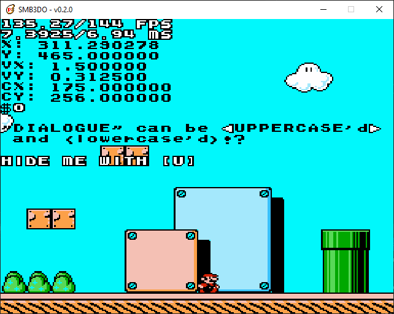
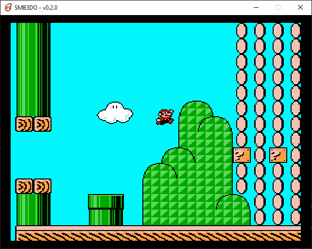
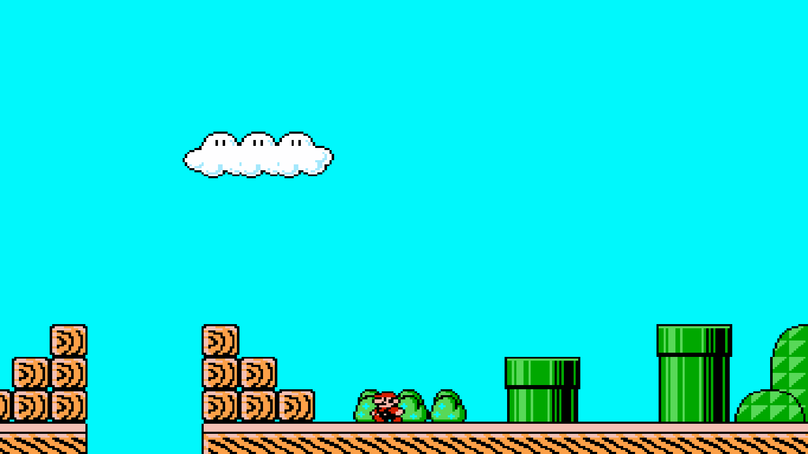
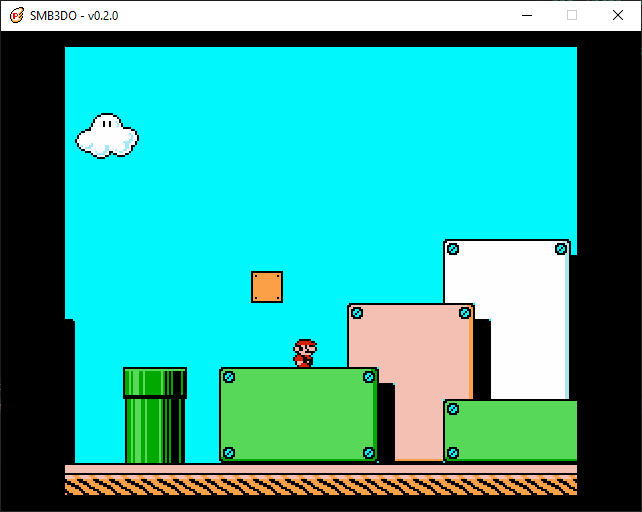

# Super Mario Bros.  3-Do (SMB3DO)
  
### A Super Mario Bros. 3 Fangame
A personal project that aims to _three_-do the classic Nintendo NES game Super Mario Bros. 3.  This project arose out of my dissatisfaction of Super Mario Maker and Super Mario Maker 2's shortcomings and limitations, particularly in the SMB3 style.  While ROM hacking is always an option, SMB3's compression makes it a particarly tricky task to mod without overwritting random memory in the ROM (last time I checked).  Plus, creating my own rendition would allow me to add new features and tweak anything to my liking.  So here we are, SMB3 remade for the modern era.

This project is written in C++14 and runs on the SDL2 framework.

##  Screenshots 
 

 

##  Features and Changelog 
### Current Release (v0.2.0)
* Basic camera
* Basic level format
* Animated Mario
* Improved variable refresh rate support
* Hitbox visualization toggle
* On-screen debug info
* Collectable coins
* Semisolid platforms
#### v0.1.0
* Keyboard input (see "How to Use")
* Hardware accelerated rendering
* Support for multiple resolutions
* Fullscreen/windowed modes
* SD/Widescreen video modes
* Basic variable refresh rate support
* Simple sprite/image blitting
* Tileset and tilemap rendering
* Tile-based collision
* Basic SMB3-accurate player physics (walking, running, and jumping)

### Long-Term Plans:
* Implement all features of the original SMB3
* Create my own SMB3 'sequel'
* User-friendly level/map/game editor
* Support for NES, All-Stars, and custom assets
* "Retro" and "Modern" video options
* Controller/keyboard support
* Linux and Windows support
* Variable refresh rate (e.g. 120 Hz) support

[Detailed development roadmap](https://docs.google.com/spreadsheets/d/1Y0XjZVZ6z5f_Yi8HuqKNcNB47MKjdfytgAIx97y7Uow/edit?usp=sharing)

##  How to Use 
Download the `.zip` file for the latest relase in the Releases tab.  Unzip to a location of your choice and then simply run `smb3do.exe`!  If you want to try out the latest features (and bugs), you can optionally build your own executable directly from the source code (see "Building From Source" below).

### Controls
* [W][A][S][D] - Move / [K] - Run / [L] - Jump
* [H] - Toggle hitbox visual
* [U] - Toggle debug info
* [I] - Toggle integer/best-fit scaling (disables widescreen mode)
* [O] - Toggle widescreen/standard mode (disables integer scaling)
* [P] - Toggle between 8:7 and 4:3 aspect ratios (i.e. between perfectly square and CRT-like pixels)
* [F11] - Toggle fullscreen/windowed mode

##  Building From Source 
The Visual Studio solution file `smb3do.sln` is included for your convenience.  However, there is a small amount of setup required:
1. Download and install [Visual Studio Community](https://visualstudio.microsoft.com/free-developer-offers/).
2. Download and install [Simple Directmedia Layer 2.0](https://www.libsdl.org/download-2.0.php) for **Visual C++ on Windows**.
3. Download/clone this repository to a location of your choice.
4. Open `smb3do.sln` from the root of the repository in Visual Studio. Follow the instructions here: [Lazy Foo' Productions - Hello SDL](https://lazyfoo.net/tutorials/SDL/01_hello_SDL/index.php) to properly link the SDL2 libraries to the project.
5. Build and run!

##  Dependencies and Utilities 
* [Simple Directmedia Layer 2.0](https://www.libsdl.org/) (v2.0.14)
* [TinyXML2](https://github.com/leethomason/tinyxml2) (v8.1.0)
* [Visual Studio Community 2019](https://visualstudio.microsoft.com/) (v16)

##  Credits 
* SmokedSeaBass - Core Programmer and Designer
### Special Thanks
* Jdaster64 - SMB3 player physics breakdown
* Southbird - SMB3 disassembly
* Christopher Hebert - ["Reconstructing Cave Story" YouTube series](https://www.youtube.com/watch?v=IufkC1IRY2Q&list=PL006xsVEsbKjSKBmLu1clo85yLrwjY67X)
* Lazy Foo' Productions - [Beginning Game Programming v2.0](https://lazyfoo.net/tutorials/SDL/index.php) (SDL2 Tutorials)
* Nintendo - Developer/Publisher of Super Mario Bros. 3
